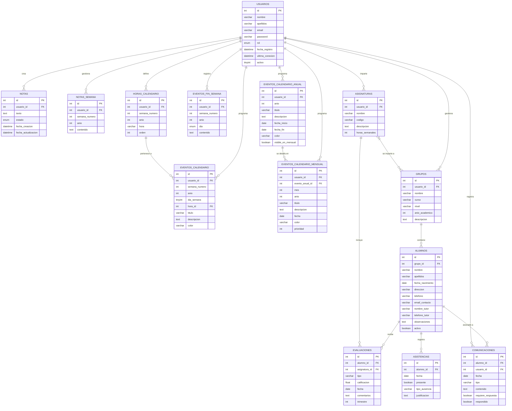

```mermaid

erDiagram
    USUARIOS ||--o{ NOTAS : "crea"
    USUARIOS ||--o{ NOTAS_SEMANA : "gestiona"
    USUARIOS ||--o{ HORAS_CALENDARIO : "define"
    USUARIOS ||--o{ EVENTOS_CALENDARIO : "programa"
    USUARIOS ||--o{ EVENTOS_FIN_SEMANA : "registra"
    HORAS_CALENDARIO ||--o{ EVENTOS_CALENDARIO : "pertenece a"
    
    %% Nuevas entidades para calendarios anual y mensual
    USUARIOS ||--o{ EVENTOS_CALENDARIO_ANUAL : "programa"
    USUARIOS ||--o{ EVENTOS_CALENDARIO_MENSUAL : "programa"
    EVENTOS_CALENDARIO_ANUAL ||--o{ EVENTOS_CALENDARIO_MENSUAL : "se detalla en"
    
    %% Sistema de gestión de alumnos
    USUARIOS ||--o{ GRUPOS : "gestiona"
    USUARIOS ||--o{ ASIGNATURAS : "imparte"
    GRUPOS ||--o{ ALUMNOS : "contiene"
    ASIGNATURAS }|--o{ GRUPOS : "se imparte a"
    ALUMNOS ||--o{ EVALUACIONES : "recibe"
    ASIGNATURAS ||--o{ EVALUACIONES : "incluye"
    ALUMNOS ||--o{ COMUNICACIONES : "asociado a"
    USUARIOS ||--o{ COMUNICACIONES : "registra"
    ALUMNOS ||--o{ ASISTENCIAS : "registra"

    USUARIOS {
        int id PK
        varchar nombre
        varchar apellidos
        varchar email
        varchar password
        enum rol
        datetime fecha_registro
        datetime ultima_conexion
        tinyint activo
    }

    NOTAS {
        int id PK
        int usuario_id FK
        text texto
        enum estado
        datetime fecha_creacion
        datetime fecha_actualizacion
    }

    NOTAS_SEMANA {
        int id PK
        int usuario_id FK
        int semana_numero
        int anio
        text contenido
    }

    HORAS_CALENDARIO {
        int id PK
        int usuario_id FK
        int semana_numero
        int anio
        varchar hora
        int orden
    }

    EVENTOS_CALENDARIO {
        int id PK
        int usuario_id FK
        int semana_numero
        int anio
        tinyint dia_semana
        int hora_id FK
        varchar titulo
        text descripcion
        varchar color
    }

    EVENTOS_FIN_SEMANA {
        int id PK
        int usuario_id FK
        int semana_numero
        int anio
        enum dia
        text contenido
    }
    
    EVENTOS_CALENDARIO_ANUAL {
        int id PK
        int usuario_id FK
        int anio
        varchar titulo
        text descripcion
        date fecha_inicio
        date fecha_fin
        varchar color
        boolean visible_en_mensual
    }
    
    EVENTOS_CALENDARIO_MENSUAL {
        int id PK
        int usuario_id FK
        int evento_anual_id FK
        int mes
        int anio
        varchar titulo
        text descripcion
        date fecha
        varchar color
        int prioridad
    }
    
    %% Entidades para gestión de alumnos
    ALUMNOS {
        int id PK
        int grupo_id FK
        varchar nombre
        varchar apellidos
        date fecha_nacimiento
        varchar direccion
        varchar telefono
        varchar email_contacto
        varchar nombre_tutor
        varchar telefono_tutor
        text observaciones
        boolean activo
    }
    
    GRUPOS {
        int id PK
        int usuario_id FK
        varchar nombre
        varchar curso
        varchar nivel
        int anio_academico
        text descripcion
    }
    
    ASIGNATURAS {
        int id PK
        int usuario_id FK
        varchar nombre
        varchar codigo
        text descripcion
        int horas_semanales
    }
    
    EVALUACIONES {
        int id PK
        int alumno_id FK
        int asignatura_id FK
        varchar tipo
        float calificacion
        date fecha
        text comentarios
        int trimestre
    }
    
    COMUNICACIONES {
        int id PK
        int alumno_id FK
        int usuario_id FK
        date fecha
        varchar tipo
        text contenido
        boolean requiere_respuesta
        boolean respondido
    }
    
    ASISTENCIAS {
        int id PK
        int alumno_id FK
        date fecha
        boolean presente
        varchar tipo_ausencia
        text justificacion
    }

```